<h1 align="center">
  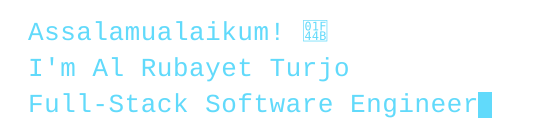
</h1>

  
  

<h5 align="center">
  <code><a href="https://linkedin.com/in/rubayet2027" title="LinkedIn"> LinkedIn</a></code>
  &nbsp;
  <code><a href="mailto:rubayetofficial2027@gmail.com" title="Email"> Email</a></code>
  &nbsp;
  <code><a href="https://al-rubayet-turjo.web.app" title="Portfolio">🌐 Portfolio</a></code>
</h5>

<h2 align="center">👋 About Me</h2>

  Hi, I'm <b>Al Rubayet Turjo</b> — a Computer Science & Engineering student at
  <b>CUET</b> and a <b>Full-Stack (MERN) Developer</b> from Bangladesh.
  I build end-to-end web applications, design clean REST APIs, and turn ideas
  into products users actually enjoy.

 

  🔭 I build full-stack web apps & REST APIs with <b>React · Node.js · MongoDB</b> 
  🤖 I explore AI-powered features, intelligent search & automation workflows 
  ☁️ I'm learning cloud deployment, <b>Docker</b> & scalable system design 
  💼 Open to opportunities: <b>Internship | Full-time | Remote</b> 
  💬 Ask me anything about MERN, TypeScript or CS — <a href="https://github.com/rubayet2027/rubayet2027/issues" title="Issues">open an issue</a> 
  📫 Reach me at: <a href="mailto:rubayetofficial2027@gmail.com">rubayetofficial2027@gmail.com</a>

<h2 align="center">🛠️ Tech Stack</h2>

 

<table>
  <tr>
    <td align="center" width="50%">
      <b>💻 Languages</b>  
      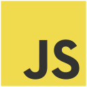
      
      
      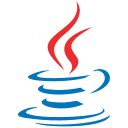
      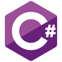
      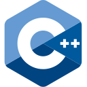
    </td>
    <td align="center" width="50%">
      <b>🎨 Frontend</b>  
      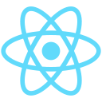
      
      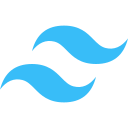
      
      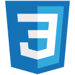
    </td>
  </tr>
  <tr>
    <td align="center" width="50%">
      <b>🗄️ Databases</b>  
      
      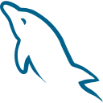
    </td>
    <td align="center" width="50%">
      <b>🚀 Backend &amp; Tools</b>  
      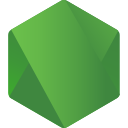
      
      
      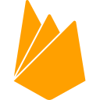
      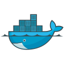
      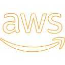
      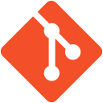
      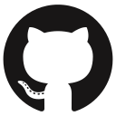
      
    </td>
  </tr>
</table>

<h2 align="center">📊 GitHub Stats</h2>

 

  <table>
    <tr>
      <td>
        <a href="https://github.com/anuraghazra/github-readme-stats">
          
        </a>
      </td>
      <td>
        <a href="https://github.com/anuraghazra/github-readme-stats">
          
        </a>
      </td>
    </tr>
  </table>

 

<h2 align="center">🎮 Contribution Activity</h2>

 

  

<h2 align="center">🚀 Featured Projects</h2>

 

  <table>
    <tr>
      <td>
        <a href="https://github.com/rubayet2027/Creatix" title="Creatix">
          
        </a>
      </td>
      <td>
        <a href="https://github.com/rubayet2027/EduXolve" title="EduXolve">
          
        </a>
      </td>
    </tr>
    <tr>
      <td>
        <a href="https://github.com/rubayet2027/hackathon" title="Hackathon Challenge">
          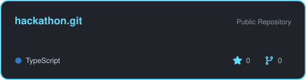
        </a>
      </td>
      <td>
        <a href="https://github.com/rubayet2027/SkillSwap" title="SkillSwap">
          
        </a>
      </td>
    </tr>
  </table>

<h4 align="center">
  <a href="https://github.com/rubayet2027?tab=repositories" title="Show Repositories">🔎 Show More 🔍</a>
</h4>

  ⚙️ Stat cards & contribution graph are auto-generated by
  <a href="https://github.com/rubayet2027/rubayet2027/tree/main/.github/workflows">GitHub Actions</a>
  · every day, right inside this repo — no third-party badge services needed.  
  Made with ❤️ by <b>Al Rubayet Turjo</b>

